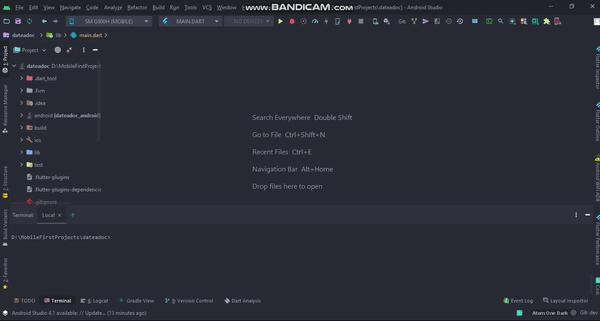

Flutter sample code base.
=============================================

A project based on Stacked State Management architecture.

Introduction
------------

This project is a sample code base that implements the MVVM architecture and uses Flutter Stacked State Management Architecture.

Technical Information used in this project:

1. Programming Language: [Flutter - Dart][0].
2. Architecture: [MVVM architecture][1] based on [Stacked State Management Architecture][2].  For more resources on learning Flutter development, visit the [Developer Guides](https://docs.flutter.dev/get-started/codelab) at [flutter.dev](https://flutter.dev/).
3. Flutter Components: ....
4. Multiple Threads: [Future][].
5. Third Party Libraries: [Stacked State Management][2], [Get It][5], [Vexana][6], [Dio][7], [Fimber][9], [etc][14],...
6. Unit Test: ...
7. [ScreenShots][15]

Moreover, you can read more detail about some project components by clicking to links contained at [References][16] part.

Implementation
--------------
Flutter version management is a big trouble that any Flutter developers have to face in their development process.
So, in this project, I have used the FVM([Flutter Version Management][18]) package to manage it easily, rapidly, and conveniently.

To install this app, you can see at FVM official [page][19].
Here, I only show you some steps to run this sample.

1. Flutter version 2.8.1 is used for this project:
```
fvm use 2.8.1
```

2. FVM setup for the Android Studio:
<p align='center'>
    
</p>

3. FVM setup for the VSCode:
Create a settings.json file on ~/.vscode folder and paste content below:
```
{
  "dart.flutterSdkPath": ".fvm/flutter_sdk",
  // Remove .fvm files from search
  "search.exclude": {
    "**/.fvm": true
  },
  // Remove from file watching
  "files.watcherExclude": {
    "**/.fvm": true
  },
  "terminal.integrated.fontFamily": "MesloLGS NF",
}
```

Libraries Used
--------------

* Third party
    * [Stacked State Management][2] for Flutter state management.
    * [Fimber][9] for logging.
    * [Get It][5], [Injectable][8] for Dependency Injection.
    * [Vexana][6], [Dio][7] for Networking.
    * [Easy Localization][10] for multiple language supporting.
    * [Hive][11], [Path Provider][12] for persistance data saving.
    * [Build Runner][13] for code generating.
    * And a few other libraries ....

[0]: https://flutter.dev/
[1]: https://en.wikipedia.org/wiki/Model%E2%80%93view%E2%80%93viewmodel
[2]: https://www.filledstacks.com/

[3]: https://viblo.asia/p/new-setup-for-flutter-stacked-state-management-ByEZkejA5Q0
[4]: https://viblo.asia/p/flutter-statemanagement-with-stacked-deep-dive-tutorial-GrLZDBRg5k0

[5]: https://pub.dev/packages/get_it
[6]: https://pub.dev/packages/vexana
[7]: https://pub.dev/packages/dio
[8]: https://pub.dev/packages/injectable
[9]: https://pub.dev/packages/fimber
[10]: https://pub.dev/packages/easy_localization
[11]: https://pub.dev/packages/hive
[12]: https://pub.dev/packages/path_provider
[13]: https://pub.dev/packages/build_runner

[14]: https://github.com/DanhDue/stacked_state_mamagement#libraries-used
[15]: https://github.com/DanhDue/stacked_state_mamagement#screenshots
[16]: https://github.com/DanhDue/stacked_state_mamagement#references

[17]: https://viblo.asia/p/bottom-navigation-with-stacked-architecture-XL6lABVp5ek
[18]: https://fvm.app/
[19]: https://fvm.app/docs/getting_started/installation
[20]: https://viblo.asia/p/handle-users-profile-in-flutter-XL6lABpJ5ek
[21]: https://viblo.asia/p/how-to-unit-test-in-flutter-Eb85ozv6l2G
[22]: https://viblo.asia/p/flutter-117-no-more-flavors-no-more-ios-schemas-command-argument-that-changes-everything-3P0lPB7gKox


Screenshots
-----------
1. Coverage Overview.


2. Unit Test Detail for a ViewModel.


3. Unit Test Detail for a Repository


References
----------
* [New Setup for Flutter Stacked State Management.][3]
* [Flutter StateManagement with Stacked - Deep Dive tutorial.][4]
* [Bottom Navigation with Stacked Architecture.][17]
* [Handle Users profile in Flutter.][20]
* [How to Unit Test in Flutter.][21]
* [Flutter 1.17 — no more Flavors, no more iOS Schemas. Command argument that changes everything.][22]


License
-------

Copyright 2021 DanhDue ExOICTIF, danhdue@gmail.com

Licensed to the Apache Software Foundation (ASF) under one or more contributor
license agreements.  See the NOTICE file distributed with this work for
additional information regarding copyright ownership.  The ASF licenses this
file to you under the Apache License, Version 2.0 (the "License"); you may not
use this file except in compliance with the License.  You may obtain a copy of
the License at

http://www.apache.org/licenses/LICENSE-2.0

Unless required by applicable law or agreed to in writing, software
distributed under the License is distributed on an "AS IS" BASIS, WITHOUT
WARRANTIES OR CONDITIONS OF ANY KIND, either express or implied.  See the
License for the specific language governing permissions and limitations under
the License.
